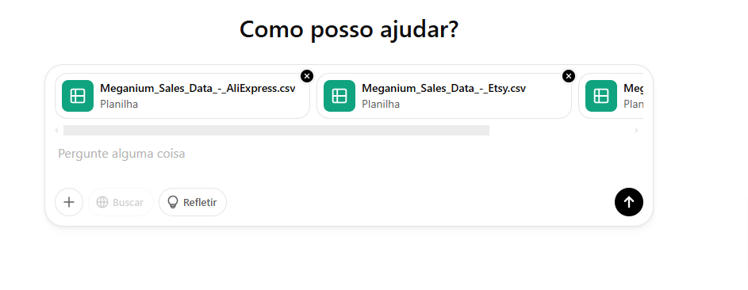

# Características 🎮

- A empresa foca apenas em fabricação de consoles, deixando a distribuição e venda para terceiros
- Os produtos são vendidos globalmente

# Passos

- Com a minha raw_data, tenho 3 bases de dados
- Na processed_data, unifico esses dados em um único arquivo
- Faço a orgnanização desses dados via Excel
- Com uma IA, passo esses dados para análise. No caso usamos o [ChatGPT](https://chatgpt.com/) - versão gratuita neste caso
- Clicando nesse '+' na esquerda, faça upload dos seus arquivos de base de dados
- Na versão gratuita, ele pode 'comer' dados. Não consegue ler tudo. É bom bases pequenas

- Prompts simples funcionam 
  

# Objetivos 🎯

- [x] Consolidar todas as bases de terceiros para realizar uma análise
- [x] Transformar dados de vendasem informações relevantes para a fabricante
- [ ] Quais são os produtos mais populares em cada país
- [ ] Como otimizar o processo de transporte e logística até o momento da venda
 